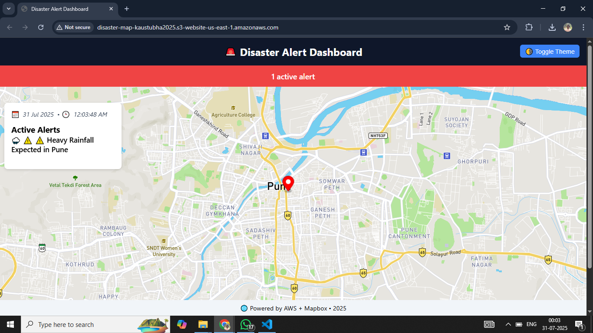
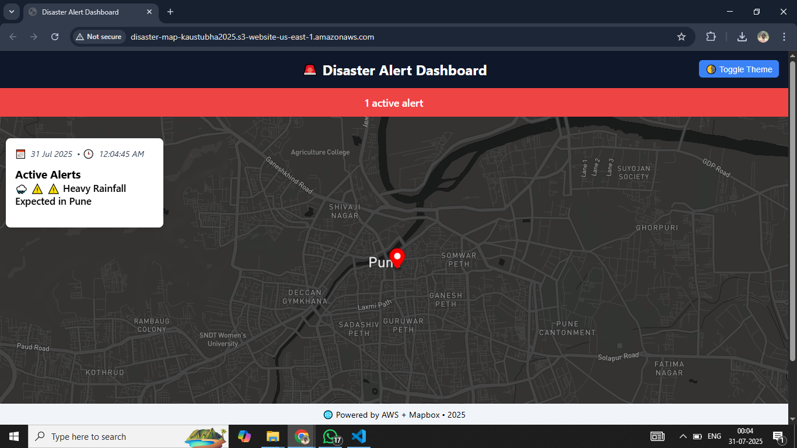

# 🌍 Disaster Alert System

A real-time disaster alert dashboard using **Mapbox**, **AWS S3**, and **JavaScript**. It fetches live alerts from an S3 bucket and displays them interactively on a map.

---

## 🚨 Features

- 📡 Live alert data from AWS S3 (JSON)
- 🗺️ Interactive map with Mapbox markers
- 🌓 Theme toggle (dark/light mode)
- 🕒 Real-time date & time display
- 🔔 Sidebar with alert messages

---

## 🛠️ Tech Stack

| Technology        | Purpose |
|------------------|----------|
| AWS Lambda       | Serverless backend to generate alerts |
| Amazon S3        | Cloud storage for alert JSON data |
| Amazon CloudWatch| Logging and monitoring Lambda execution |
| Amazon EventBridge | Scheduled trigger for Lambda |
| IAM              | Role-based access control |
| Mapbox GL JS     | Frontend interactive map visualization |
| HTML/CSS         | Web interface design |
| JavaScript       | Fetch API + Map logic + DOM manipulation |

---

## 🔆 Light Mode

## 🌙 Dark Mode

